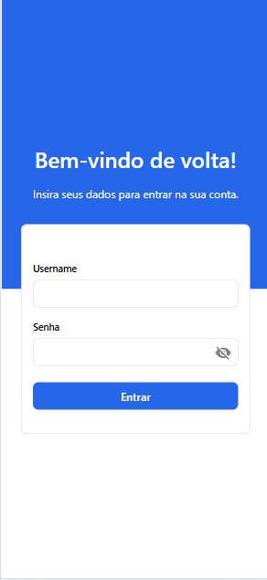
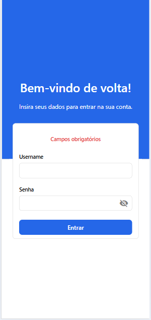
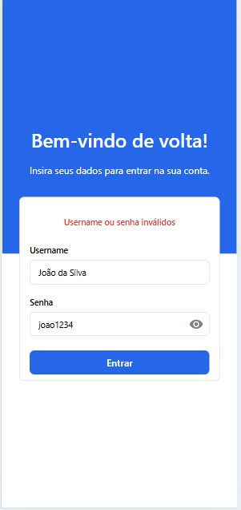
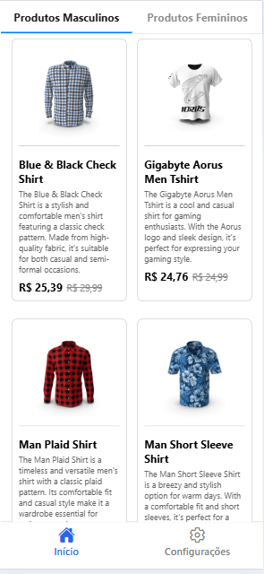
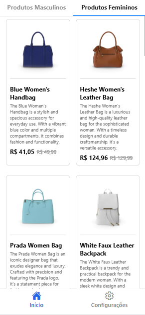
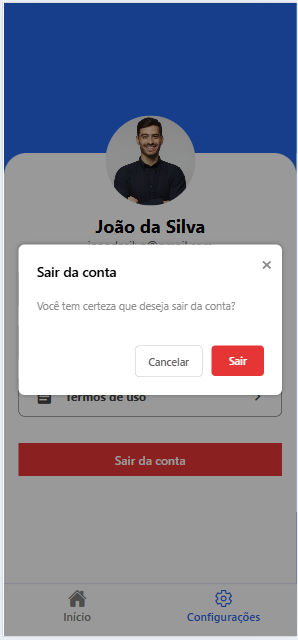

# 🛍️ Catálogo de Produtos – App Mobile com React Native

Aplicativo desenvolvido em **React Native com Expo**, que consome dados de uma **API externa** para exibir produtos. O projeto utiliza **Redux Toolkit** para gerenciamento de estado global e **Axios** para as requisições HTTP. O foco principal é oferecer uma experiência rápida, intuitiva e funcional ao usuário.  
(Projeto Acadêmico)

---

## 📱 Prints das Telas

**Tela de Login**  


**Tela de Login com Validação e Autenticação**<br />
<div>
  
  
</div>


**Catálogo de Produtos Masculino e Feminino**<br />
<div>
  
  
</div>


**Tela de Configurações**  


**Modal de Confirmação**  


---

## 🚀 Funcionalidades

- Login com validação de campos  
- Consumo de API externa para exibir lista de produtos  
- Gerenciamento de estado com Redux Toolkit  
- Tela de configurações com dados do perfil  
- Modal de confirmação ao clicar em "Sair"  
- Logout com redirecionamento seguro  
- Interface responsiva e otimizada para dispositivos móveis

---

## 🛠️ Tecnologias Utilizadas

- [React Native](https://reactnative.dev/)  
- [Expo](https://expo.dev/)  
- [Redux Toolkit](https://redux-toolkit.js.org/)  
- [Axios](https://axios-http.com/)  
- [React Navigation](https://reactnavigation.org/)  
- [Expo Router](https://expo.dev/router)

---

## ⚙️ Como Executar o Projeto

### ✅ Pré-requisitos

- axios  
- @react-navigation/native  
- @reduxjs/toolkit  
- react-redux  
- expo-router

```bash
npm install axios
npm install @react-navigation/native
npm install @reduxjs/toolkit react-redux
npm install expo-router
